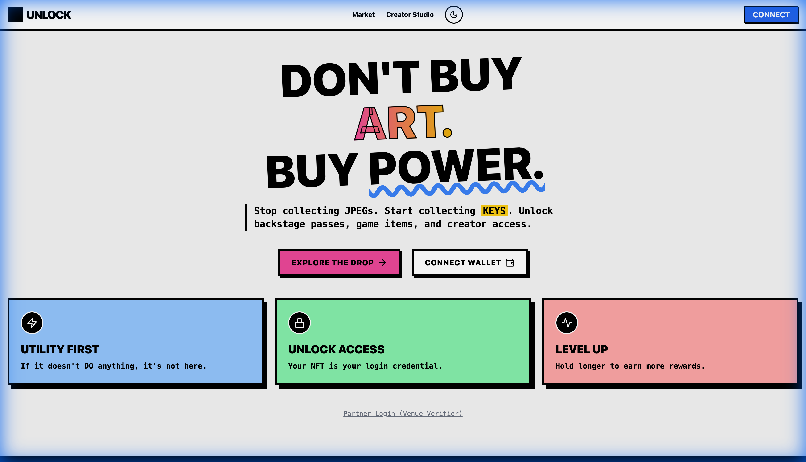
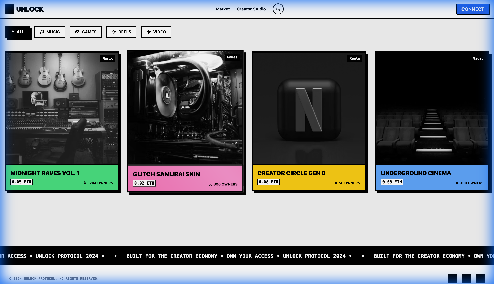
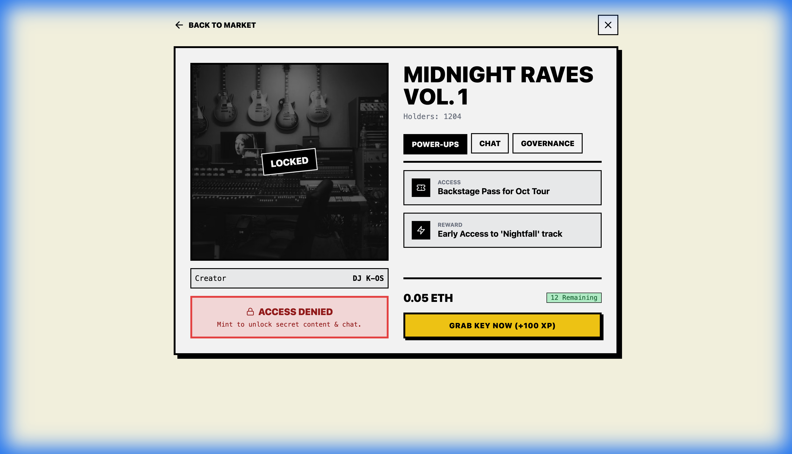
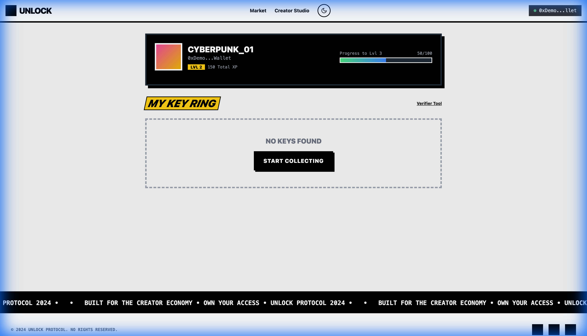
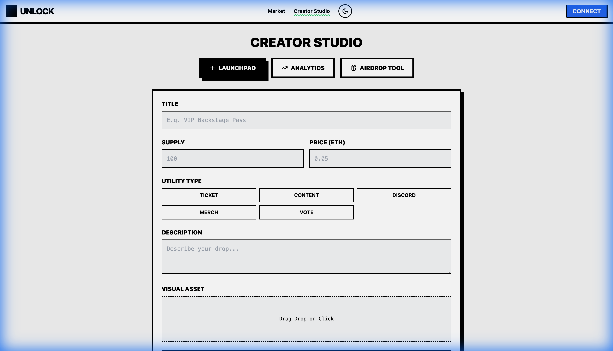

# 🔓 UNLOCK: The Utility NFT Marketplace

## 🌟 What is UNLOCK?
**UNLOCK** is a high-fidelity prototype of a next-generation NFT marketplace focused on **Utility**. Unlike traditional marketplaces that focus primarily on art and speculation, UNLOCK is built around the "Key" economy—where NFTs serve as digital keys to unlock exclusive content, communities, and real-world experiences.

This prototype demonstrates a Neo-Brutalist design aesthetic with a robust feature set including gamified XP systems, interactive utility polls, and a dedicated creator studio.

---

## 🚀 Key Features

### 1. Utility-First Marketplace
Discover NFT "Drops" filtered by category (Music, Games, Video, Reels). Each drop explicitly lists its "Utilities"—what you actually get by holding the token.

### 2. Deep Project Insights
The Detail View provides a 360-degree look at the NFT, including:
- **Utility Status**: Real-time tracking of what's ready to be used and what's still "locked."
- **Community Chat**: Connect directly with other holders.
- **Interactive Polls**: Holders can vote on the project's future (e.g., "Which city should I tour next?").

### 3. Gamified Experience (XP & Leveling)
UNLOCK rewards active users. Connecting your wallet, minting NFTs, and participating in polls earns you **XP**. High-level users can unlock special perks (demonstrated in the Profile view).

### 4. Creator Studio
A streamlined portal for creators to launch their own utility-backed collections. Define your price, supply, and specific utility types (Tickets, Content, Discord Access, etc.) with just a few clicks.

---

## 🛠️ How it Works (Real-World Product)

In a production environment, UNLOCK would function as follows:

1.  **Identity**: Users connect via Web3 wallets (MetaMask, WalletConnect).
2.  **Asset Ownership**: NFTs are minted on a Layer 2 blockchain (like Base or Polygon) to ensure low gas fees and high speed.
3.  **Dynamic Metadata**: Utilities are stored on-chain or via IPFS. When a creator updates a utility (e.g., releases a new track), the NFT "unlocks" that content for the holder automatically.
4.  **Verification**: The **Verifier Node** (included in the app) allows event organizers or brands to scan a user's QR code and instantly verify ownership of a required "Key" for entry.

---

## 🕹️ How to Interact with the App

1.  **Explore**: Use the **Market** to browse current drops.
2.  **Analyze**: Click any card to see its specific utilities and holder stats.
3.  **Engage**:
    -   **Connect Wallet**: Simulates the Web3 login process.
    -   **Mint**: "Buy" a key to add it to your collection.
    -   **Vote**: Use the poll in the detail view to influence the project.
4.  **Create**: Go to **Creator Studio** to simulate launching your own project.
5.  **Verify**: Access the **Verifier** view to see how the platform looks for staff at a real-world event.

---

## 💻 Technical Stack
- **Frontend**: React.js with Tailwind CSS (Neo-Brutalist UI).
- **Icons**: Lucide-React.
- **Backend (Mocked)**: Firebase (Auth & Firestore ready).
- **Architecture**: Modular component-based structure.

---

## ⚙️ Local Setup

1. Clone the repository.
2. Run `npm install`.
3. Create a `.env` file (see `.env.example`).
4. Run `npm start`.

*Note: This prototype currently runs in **Mock Mode** for UI testing without requiring active Firebase keys.*
